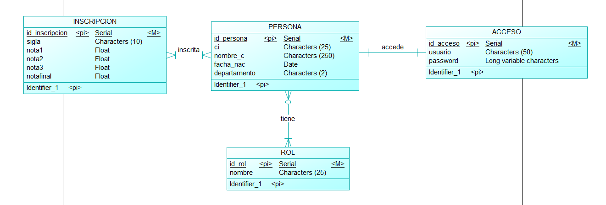

# Examen 1er Parcial INF-324
> Nombre: Neil Angel Graneros Flores.
>
> CI: 9911843 LP
## Comentarios del Proyecto

Este examen Licenciado lo realice en Docker ya trabajarr en contenedores es mucho más viable. Algunos inconvenientes que tuve fue más que todo con **CODEIGNITER** ya que el entorno no pudocompilar y aceptar la configuración que le dí, exceptuando ese inconveniente los demás ejercicios fueron realizados.

## Base de Datos
Para la base de datos se uso **Postgres**, primeramente se trabajo en el modelo Conceptual segun los campos vistos en el examen, para depues pasar al modelo físico, teniendo las entidades y atributos que se usaron para crear la BD.

## Modelo Físico


En el archivo `db.sql` se encuentra el script para la creación de la tablas e inserción de datos.
Se debe hacer una conexión con el contenedor esto se puede lograr deacrgando una extención en VSCode para generar la conexión
En `docker-compose.yaml` esta la configuración de la bd como el nombre de usuario, passwor, etc.

## ¿Cómo ejecutar los proyectos?

Primeramente debemos de tener intalado [Docker](https://www.docker.com). Despues de que ya lo tengamos instalado realizamos un **git clone** a este repositorio.
```
git clone https://github.com/reveluv1814/PrimerExamen324.git
```
Ingresando a la carpeta principal del proyecto debe teclear el siguiente comando para iniciar los contenedores:
```
docker-compose up
```
Se descargará todas las dependencias y paquetes necesarios para nuestros contenedores. Cuando termina la descarga ya puede ingresar a los incisos dados.
# Rutas de Localhost por Sentencia

## PHP
Para los problemas relacionados con PHP debemos ir a la carpeta **html** ahí estarán las soluciones de cada sentencia. Para acceder debemos ingresar a Localhost:8080.
```sh
//PHP 
Localhost:8080/sentenci.....
```
## PYTHON
Para la parte de Python se uso **Django** para crear la solución. Para este caso se debe teclear en la terminal estos comandos que inicializarán el proyecto:

### DJANGO INIT 
```sh
docker-compose  run python django-admin startproject webpython .
```
### INICIAR APP
```sh
docker-compose  run python python manage.py startapp sentencia6 .
```
Con esto se creerá el Proyecto con una aplicación, en este caso la sentencia 6. Para acceder debemos ingresar a Localhost:5000.
```sh
//Python
Localhost:5000/sentencia6
```
## VisualStudio .NET 

Para este caso se uso el Framework además de nuestro Postgres que esta en nuestro contenedor. Mientras este activo nuestro servicio de Postgres podremos ejecutar el proyecto.
Este se encuentra en la carpeta principal, dentro de la carpeta **Sentencia 8**
## Conclusiiones
Despues de terminado hasta donde se pudo el examén, se logro completar la mayoria de la prueba experimentando con Docker y Django tecnologías que recientemente vi y me animé a solucionar el examén con estos entornos. Muchas gracias Licenciado si se tomó el tiempo de leer este apartado.

